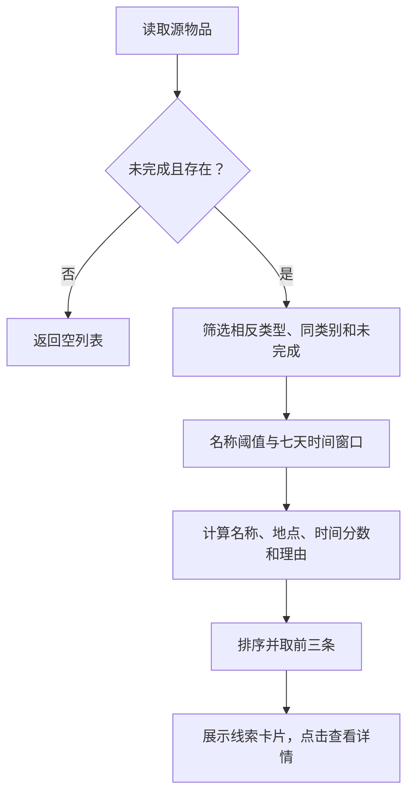

# 加分功能：相似寻物／招领线索推荐

## 解决的问题

寻物者通常只检查自己的发布，可能遗漏已经发布的招领信息。详情页主动展示另一类的相似记录，帮助双方缩小搜索范围。该功能延续原型“浏览—详情—联系”的流程，与照片上传一起作为额外功能展示。

## 输入与输出

输入为当前数据列表和物品编号；输出为最多三条 `{item, score, reasons}`。分数只用于内部排序，页面显示可核对的理由，不把分数称为找到物品的概率。照片、联系方式、发布者身份不参与评分。

## 筛选与评分

| 规则 | 行为 |
| --- | --- |
| 源记录未完成 | 已完成或不存在时返回空列表 |
| 相反类型、同类别、未完成 | 寻物对应招领，招领对应寻物，排除自身 |
| 名称相似度至少 0.25 | 名称无关时即使地点和类别相同也不推荐 |
| 两个有效事件时间 | 相差超过七天排除；无效时间不给时间加分 |
| 名称 | 相似度乘 60，四舍五入 |
| 类别 | 同类别加 15 |
| 地点 | 文字相似度至少 0.25 时，相似度乘 15 |
| 时间 | 不超过一天加 10，不超过三天加 7，其余七天内加 4 |
| 排序 | 分数降序，其次发布时间降序，最后编号顺序 |

名称和地点首先做 Unicode NFKC 规范化，忽略大小写、空格及标点。相同字符串相似度为 1；至少两字的包含关系为 0.85；其余使用连续双字集合的交并比。例：黑色雨伞／蓝色雨伞共享“色雨”“雨伞”，相似度为 2/4=0.5。黑色雨伞／黑色水杯仅共享“黑色”，相似度为 1/5=0.2，低于阈值。

事件时间以记录中的年月日时分计算，使用 UTC 构建一个统一比较基准，不进行用户时区转换，并回查各分量拒绝日期溢出。使用丢失／捡到时间，避免把发布时间误当作事件时间。时间窗口采用绝对差，允许发布时间录入顺序不同。

## 处理流程



## 关键代码

对应 `js/recommendations.js` 中的 `recommend`：

```javascript
if (item.id === source.id || item.type !== opposite ||
    item.status !== 'active' || item.category !== source.category) return;
const name = similarity(source.title, item.title);
if (name < 0.25) return;
const targetTime = eventTimestamp(item.eventTime);
const validTime = Number.isFinite(sourceTime) && Number.isFinite(targetTime);
const gap = validTime ? Math.abs(sourceTime - targetTime) / DAY : NaN;
if (validTime && gap > 7) return;
```

详情每次按编号读取最新共享数据并重新计算推荐，无需保存额外推荐数据。状态更新、编辑或删除成功后，下一次打开详情自然使用最新记录。推荐卡片沿用通用卡片组件，保留当前列表来源。

## 局限与后续完善

文字匹配无法识别“伞／雨伞”等所有同义词，也不能理解地点的实际距离。阈值为本项目的演示选择，未通过大规模数据标定，存在误报和漏报。不同类型、类别、描述录入不一致也可能导致遗漏。用户应核对照片、特征和时间后自行联系。搭档可用真实的人工测试案例评估这些边界，再通过 PR 改进。

## 博客取证

建议保存详情页推荐区域截图、点开线索后的详情截图及测试汇总截图。博客中说明用途、上述流程、实际代码与测试设计。截图需在浏览器实际运行后获取；此文档没有代填截图或虚构人工测试结论。
